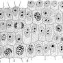

# zewu2491_9103_tut8
# Overview

This project is a functional prototype created using p5.js. It features animated circle patterns that change over time. The animation is driven by time, and various properties of the circles, such as color and position, are animated to create a dynamic visual experience.

# Animation Driver: Time

I chose to drive my individual code using time. The animation evolves based on the elapsed time since the start of the program.

# Animated Properties

Small Circles Movement: The small circles within the big circles move towards the center, then to the edge, rotate around the edge, and finally move back to the center.
Color Changes: The colors of the small red circles and the additional rings of the big circles change over time.
Movement Patterns: The small circles follow a specific sequence of movements (center, edge, rotate, center again) which is unique compared to other group members.
Color Animation: The colors of the small red circles and the additional rings change continuously, creating a dynamic visual effect.

# Inspiration

The inspiration for this animation came from various sources, including:

Nature: When I looked at our final code, I thought about the structure of cells that I had learned about before. These circles and lines, big and small, are like the basics that make up the world: cells. So I wanted to show a sense of well-organized atmosphere with regular variations of colors and circles.

Art: Abstract art that uses geometric shapes and colors to create visually appealing patterns.
Technical Explanation

# How It Works

Setup: The setup function initializes the canvas and creates the big circles and small red circles.
Draw: The draw function is called repeatedly to update the animation. It updates the positions and colors of the circles based on the elapsed time.
State Machine: The CirclePattern class uses a state machine to control the movement of the small circles. The states include moving to the center, moving to the edge, rotating on the edge, and moving back to the center.
Color Update: The updateColor method in the RedCirclePattern class changes the color of the small red circles over time.

# Changes to Group Code

State Machine: Added a state machine to control the movement of the small circles within the big circles.
Color Animation: Implemented color changes for the small red circles and the additional rings of the big circles.

# Main improvements and descriptions

RedCirclePattern class:

Added updateColor method to make the color of the red circle change over time.
CirclePattern class:

Added state and stateStartTime properties to manage the animation state of the small circles.
In the updateSmallCircles method, multiple states (moveToCenter, moveToEdge, rotateOnEdge, moveToCenterAgain and randomDistribution) are added to realize different animation effects of the small circles.
Added updateRingColors method to change the color of the nested circles over time.
setup function:

Use setInterval method to update animationTime, assuming frame rate is 60 FPS.
draw function:

Call updateColor method before drawing the small red circle.
Call updateSmallCircles and updateRingColors before drawing the big circle.

# Extra code to learn

I learned how to accomplish the clockwise rotation effect mainly at the following website.

(https://stackoverflow.com/questions/26802817/clockwise-and-then-anticlockwise-rotation-in-javascript)

Auto Color Changing

（https://stackoverflow.com/questions/48187722/how-to-change-background-color-of-webpage-every-5-seconds-using-an-array-of-colo）

# Coding Technique Exploration

## atan2()
Calculates the angle formed by a point, the origin, and the positive x-axis.

(https://p5js.org/reference/#/p5/atan2)

## dist()
Calculates the distance between two points.

（https://p5js.org/reference/#/p5/dist）